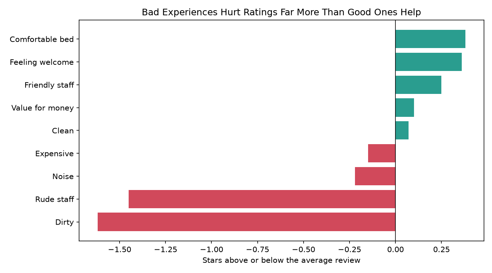
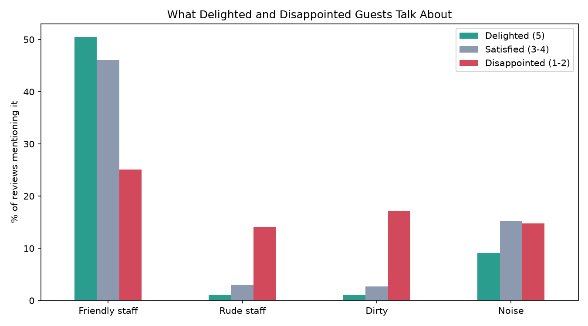

# What Makes Hotel Guests Feel Welcome?
### An Analysis of 20,491 Hotel Reviews

## The Problem
Hospitality is about how guests feel. U.S. hotels are selling a record number of rooms,
but owners are under pressure from rising costs and staffing shortages. When budgets are
tight, hotels need to know which parts of the guest experience matter most, so they can
invest where it counts.

## The Question
**What separates the guests who leave glowing reviews from the ones who leave
disappointed, and where should a hotel focus to make guests feel welcome?**

## Key Findings

- **Bad experiences hurt far more than good ones help.** Reviews mentioning dirt average
  2.33 stars and reviews mentioning rude staff average 2.51, against an overall average of
  about 3.96. The strongest positive theme, a comfortable bed, adds only about 0.38 stars.
- **Disappointed guests point to two problems.** 17.1% of 1–2 star reviews mention dirt and
  14.1% mention rude staff, compared with just 1.0% each in 5-star reviews.
- **Warm, helpful staff is what delighted guests remember.** Half of 5-star reviews (50.5%)
  mention friendly or helpful staff, twice the rate in disappointed reviews (25.1%).
- **Noise costs a star, but rarely ruins a stay.** It appears about as often in 3–4 star
  reviews (15.3%) as in 1–2 star reviews (14.8%).
- **About 1 in 6 guests leave disappointed** (16%), while 44% leave delighted.

## Recommendation
Making guests feel welcome comes down to the basics. Before spending on upgrades, a hotel
should protect two things that drive guests away: **cleanliness** and **respectful
service**. That means consistent room inspection standards, and hiring and training for
warmth, not just efficiency. Noise reduction is a worthwhile second step.

## Questions This Project Answers
1. How are ratings spread out: how many guests are delighted, satisfied, or let down?
2. Which topics show up most in 5-star reviews compared with 1- and 2-star reviews?
3. How much do staff, cleanliness, room comfort, noise, and value affect a guest's rating?
4. Which improvements would make the biggest difference to how welcome guests feel?

## Methods
- Loaded 20,491 reviews into a SQLite database
- Tagged reviews by theme using SQL keyword searches (`LIKE`) and combined them with `UNION ALL`
- Compared each theme's average rating with the overall average
- Grouped guests as delighted (5★), satisfied (3–4★), or disappointed (1–2★), and calculated
  the share of each group mentioning each theme

**Limitation:** keyword matching is a simple first pass. For example, "clean" also matches
"not clean." A next step would be sentiment analysis that reads each sentence in context.

## Data
About 20,000 hotel reviews from TripAdvisor, each with the guest's written review and their
star rating (1 to 5).

Source: "Trip Advisor Hotel Reviews" dataset on Kaggle
(https://www.kaggle.com/datasets/andrewmvd/trip-advisor-hotel-reviews).

## Project Structure
- `data/`: the reviews CSV and SQLite database
- `sql/`: SQL queries (review themes, guest group comparison)
- `src/`: Python scripts, run in order 01 → 04
- `output/`: charts

## Tools
Python (pandas, matplotlib), SQL (SQLite)